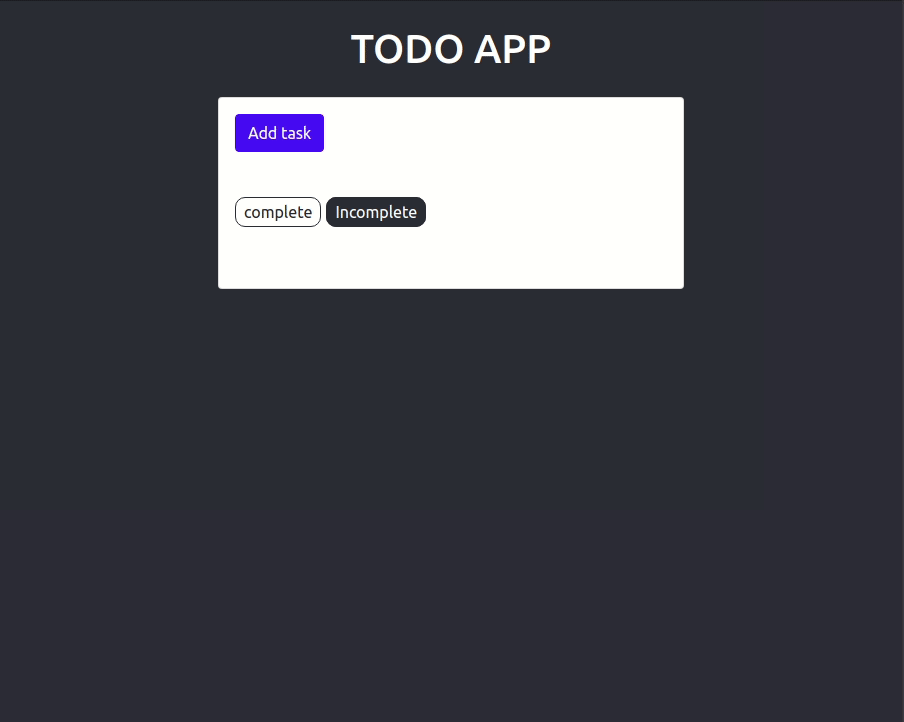

# DRF React ToDo
A dead simple Django + React ToDo Web App

This is the third iteration of the ToDo List with Django. 
>This time with DRF and React

## Demo 🔰
<p align="center">
</img>
</p>

## Features

- Dead simple
- CRUD
- Simple UI
- Blazing fast

## Setup

### Django 🎇

- Download the files from this repo
- Change the directory to the folder where you downloaded files
  ```bash
    $cd todo-react 
    ```
- For installing required packages, execute the following command in terminal:

    ```bash
    $pip install pipenv
    $pipenv install 
    ```

- After successful installation execute the following commands:

    ```bash
    $python manage.py migrate
    $python manage.py runserver
    ```

### React ❄

- Change directory to frontend and install dependacies:
  ```bash
  $cd frontend
  $npm install 
  ```

## Run the application
- Start the django server in the backend directory
- Start React app in frontend directory
    ```bash
    $python manage.py runserver

    $cd ../frontend
    $npm start
    ```


- Visit `127.0.0.1:3000` in your browser to enjoy the awesome app!

Built with ♥ by [`Animesh Singh`](http://github.com/AnimeshRy)


